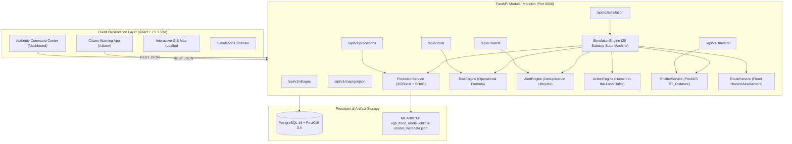

# Flowshield — Architecture Documentation

## 1. System Topology

## 2. End-to-End Data Pipeline Execution Sequence

1. **Environmental Observation**: Synthetic sensor reading or simulation step generates meteorological-hydrological vector for a settlement.
2. **Schema & Bounds Validation**: Vector verified against `FEATURE_SCHEMA` and `FEATURE_BOUNDS`.
3. **ML Inference**: `model.predict_proba()` calculates raw flood probability.
4. **Local Feature Attribution**: `shap.TreeExplainer` generates local attribution scores for all features, sorted into top positive/negative contributors.
5. **Operational Risk Assessment**: `RiskEngine` calculates 0–100 risk score incorporating ML probability, temporal trend multiplier, demographic vulnerability, and sensor quality/freshness caps.
6. **GIS Zone Update**: Voronoi catchment polygons for the settlement are styled with the new risk level color.
7. **Alert Evaluation**: If risk exceeds 50 (HIGH) or 75 (CRITICAL), the `AlertEngine` creates an active alert unless a deduplication key matches an existing active alert.
8. **Action Synthesis**: `ActionEngine` binds recommended decision-support guidelines with mandatory human-in-the-loop disclaimers.
9. **Shelter Nearest Evaluation**: `ShelterService` runs `ST_Distance` to return nearest relief facilities and adjust occupancy based on simulated evacuation intake.
10. **Route Risk Assessment**: `RouteService` evaluates designated evacuation corridors; segments crossing high river floodways are marked blocked.
11. **Citizen Broadcast**: `/citizen` displays plain-language warning status, safety checklist, and direct nearest-shelter directions.
