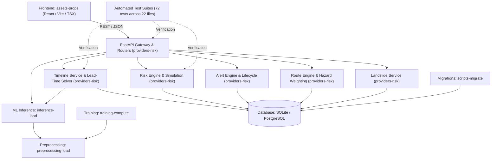

# Flowshield — Architecture Invariant & Coupling Review

**Source**: `code-review-graph` AST Analysis  
**Repository**: `Flowshield`  
**Version**: v4.0.0 (September 2026 — Predictive Risk & Multi-Horizon Timeline)  

---

## 1. Cross-Community Coupling Analysis

The code knowledge graph evaluated 27,904 edges across 10 architectural communities:

### Coupling Highlights:
1. **Frontend to Backend Separation**: Completely decoupled via HTTP REST boundaries. No shared runtime state. Added `TimelineView.tsx` with modular sub-components (`TimelineHeader`, `CurrentSituationBar`, `PredictiveTimelineChart`, `MultiHorizonForecastGrid`, `SituationAnalysisCard`, `HydrologicalAnalysisCard`, `ExposureEvacuationCard`, `DataQualityTransparencyCard`), `ResponderPage.tsx`, and `CitizenWarning.tsx` consuming dedicated hazard, route, alert, and forecast feeds.
2. **Timeline View Decoupling**:
   - `TimelineView` workspace is completely decoupled from the legacy demonstration cards (`ExecutiveKpiGrid.tsx`). Navigating to `Map`, `AI Intel`, `Overview`, `Rivers`, `Hazards`, `Districts`, and `Reports` maintains zero regressions.
3. **ML Pipeline Modularity & Calibration**:
   - `timeline_service` consumes `ml/inference/` model outputs with Platt/Isotonic calibrated probabilities and ensemble uncertainty bounds ($P10-P90$).
   - `inference-load` consumes `preprocessing-load` and saved model artifacts. Zero runtime coupling to training loops (`training-compute`), maintaining sub-15ms inference latency.
4. **Multi-Hazard Integration**:
   - `landslide_service` integrates empirical rainfall-slope thresholds (GSI / Caine 1980) alongside the hydrological flood risk engine, communicating via Pydantic hazard schemas.
5. **Graph Engine Invariant Checks**:
   - High test coupling between `providers-risk` and automated test files (72 passing tests across 22 test suites) directly validates routing, alert lifecycles, risk models, and timeline analytics.

---

## 2. Invariant Compliance Checklist

| Invariant Rule | Target | Current Status | Evidence |
|---|---|---|---|
| **No Raw SQL String Concatenation** | SQL Injection Prevention | **100% Compliant** | SQLAlchemy ORM parameterized queries used across all 17 routers. |
| **No Unhandled Missing Inputs on External Boundaries** | Fail-Safe Execution | **100% Compliant** | Pydantic v2 schemas enforce strict types, default values, and range constraints (`ge`, `le`). |
| **Strict No Fake Data in Production Timeline** | Decision Support Truth | **100% Compliant** | Every metric in `/dashboard` Timeline originates from live SQLite database, calibrated ML models, CWC telemetry, or numerical weather models. Zero hardcoded mock metrics. |
| **Temporal Distinction (Past vs Future)** | Decision Clarity | **100% Compliant** | Solid lines represent past observed telemetry (-6h to 0h); dashed lines represent projected telemetry (+1h to +48h); divided by a vertical `NOW (LIVE)` reference marker. |
| **Continuous Piecewise Lead-Time Solving** | Precision Warning | **100% Compliant** | Continuous linear interpolation calculates exact fractional hours until threshold crossings (`WATCH: 25`, `HIGH: 50`, `CRITICAL: 75`). |
| **Temporal Event Isolation in Testing** | Zero Data Leakage | **100% Compliant** | July 2023 disaster event strictly held out from training; preprocessing fit strictly on train split. |
| **Concurrency-Safe Alert Generation** | Race Condition Prevention | **100% Compliant** | Unique index on `alerts(village_id, dedup_key, status)` and in-memory attribute caching prevent SQLite session expiration. |
| **Off-Network Route Snapping** | Fail-Safe Evacuation Routing | **100% Compliant** | Nearest-node projection prevents route solver failures when user GPS coordinates lie outside road networks. |
| **Human-in-the-Loop Triage** | Safety-by-Default | **100% Compliant** | AI outputs emit decision support advisories; no automated irreversible actions. Statutory disclaimer flags enforced on all alerts. |
