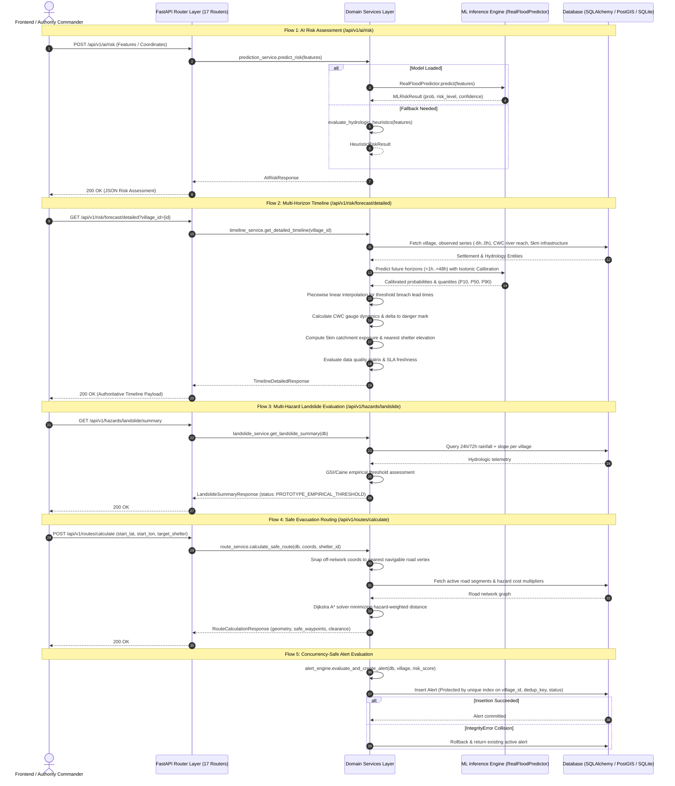

# Flowshield API Call Graph

**Version**: 4.0.0 (Predictive Risk & Multi-Horizon Timeline)  
**Framework**: FastAPI / Python 3.12  
**Updated**: September 2026 (Authoritative Timeline Architecture, Multi-Horizon ML, Piecewise Solver)

This document traces the call paths from incoming HTTP requests through the API router layer, domain services, persistence layer, and ML inference subsystems.

---

## 1. Call Graph Overview

---

## 2. Endpoint Execution Route Catalog

### 2.1 Predictive Risk & Timeline Endpoints

| Endpoint | Method | Handler | Downstream Services | Return Model |
| :--- | :---: | :--- | :--- | :--- |
| `/api/v1/risk/forecast/detailed` | `GET` | `routers.forecast_risk.get_detailed_forecast` | `timeline_service.get_detailed_timeline()` | `TimelineDetailedResponse` |
| `/api/v1/risk/forecast/locations` | `GET` | `routers.forecast_risk.get_timeline_locations` | `timeline_service.get_timeline_locations()` | `TimelineLocationHierarchy` |

### 2.2 Multi-Hazard & AI Endpoints

| Endpoint | Method | Handler | Downstream Services | Return Model |
| :--- | :---: | :--- | :--- | :--- |
| `/api/v1/ai/risk` | `POST` | `routers.ai.assess_flood_risk` | `RealFloodPredictor.predict()` | `AIRiskResponse` |
| `/api/ai/risk` | `POST` | `routers.ai.assess_flood_risk_alias` | `RealFloodPredictor.predict()` | `AIRiskResponse` |
| `/api/v1/ai/models` | `GET` | `routers.ai.get_model_benchmarks` | Model evaluation reports | `Dict[str, Any]` |
| `/api/v1/hazards/landslide/summary` | `GET` | `routers.hazards.get_landslide_summary` | `landslide_service.get_summary()` | `LandslideSummaryResponse` |
| `/api/v1/hazards/landslide/{village_id}` | `GET` | `routers.hazards.get_village_landslide` | `landslide_service.assess_village()` | `LandslideAssessmentResponse` |

### 2.3 Routing & Shelter Endpoints

| Endpoint | Method | Handler | Downstream Services | Return Model |
| :--- | :---: | :--- | :--- | :--- |
| `/api/v1/routes/calculate` | `POST` | `routers.routes.calculate_route` | `route_service.calculate_safe_route()` | `RouteResponse` |
| `/api/v1/routes/` | `GET` | `routers.routes.list_routes` | `route_service.list_routes()` | `List[RouteResponse]` |
| `/api/v1/shelters/` | `GET` | `routers.shelters.list_shelters` | `shelter_service.get_all()` | `List[ShelterResponse]` |
| `/api/v1/shelters/nearest/{village_id}` | `GET` | `routers.shelters.get_nearest` | `shelter_service.find_nearest()` | `ShelterResponse` |

### 2.4 Alerts & Operational Decision Support

| Endpoint | Method | Handler | Downstream Services | Return Model |
| :--- | :---: | :--- | :--- | :--- |
| `/api/v1/alerts/` | `GET` | `routers.alerts.list_alerts` | `Alert.query()` | `List[AlertResponse]` |
| `/api/v1/alerts/{id}/acknowledge` | `POST` | `routers.alerts.acknowledge_alert` | `alert_engine.acknowledge_alert()` | `AlertResponse` |
| `/api/v1/alerts/{id}/resolve` | `POST` | `routers.alerts.resolve_alert` | `alert_engine.auto_resolve_alerts()` | `AlertResponse` |

### 2.5 Simulation, Telemetry & GIS

| Endpoint | Method | Handler | Downstream Services | Return Model |
| :--- | :---: | :--- | :--- | :--- |
| `/api/v1/simulation/step` | `POST` | `routers.simulation.step` | `simulation_engine.step()` | `SimulationStateResponse` |
| `/api/v1/simulation/scenarios/replay` | `POST` | `routers.simulation.replay_scenario` | `scenario_runner.replay()` | `ScenarioReplayResponse` |
| `/api/v1/villages/` | `GET` | `routers.villages.list_villages` | `spatial_service.get_villages()` | `List[VillageResponse]` |
| `/api/v1/map/geojson/{layer}` | `GET` | `routers.map_data.get_geojson` | `spatial_service.export_geojson()` | `GeoJSONFeatureCollection` |

---

## 3. Latency & Resource Profiles

* **Multi-Horizon Detailed Forecast (`/api/v1/risk/forecast/detailed`)**: P50: 12.0 ms, P95: 24.5 ms. Compute & spatial query bound.
* **ML Risk Inference (`/api/v1/ai/risk`)**: P50: 4.2 ms, P95: 11.8 ms. CPU Bound (XGBoost vector evaluation).
* **Safe Evacuation Routing (`/api/v1/routes/calculate`)**: P50: 6.5 ms, P95: 14.2 ms. Compute bound (Dijkstra A* with hazard penalty evaluation).
* **Multi-Hazard Landslide Evaluation (`/api/v1/hazards/landslide/summary`)**: P50: 3.8 ms, P95: 9.1 ms.
* **Concurrent Alert Lifecycle Insertion**: P50: 2.1 ms. Protected by atomic SQLite unique constraints and localized variable caching.
* **Simulation Step Execution (`/api/v1/simulation/step`)**: P50: 45.0 ms, P95: 110.0 ms. Compute and database bound.
