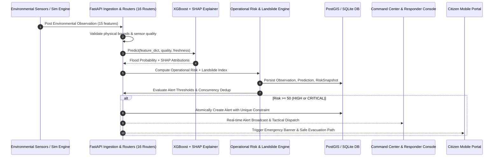

# Flowshield — System Architecture

---

## 1. Architectural Philosophy: The Modular Monolith

Flowshield is architected deliberately as a **clean, modular monolith** rather than a distributed microservices cluster. In life-critical disaster decision-support systems, operational reliability, atomic transactions, deterministic state transitions, and sub-second end-to-end latency take absolute priority over distributed complexity.

```
┌────────────────────────────────────────────────────────────────────────┐
│                        FLOWSHIELD ARCHITECTURE                         │
├────────────────────────────────────────────────────────────────────────┤
│  PRESENTATION LAYER (React 18 + TypeScript + Vite)                    │
│  ┌──────────────────────────────┐  ┌────────────────────────────────┐  │
│  │ Authority Command Center     │  │ Citizen Mobile Mode (320px+)   │  │
│  │ (Leaflet GIS, Recharts,      │  │ (High-Contrast Alert Banners,  │  │
│  │  Simulation Timeline, SHAP)  │  │  Safe Shelter GPS, 1-Tap SOS)  │  │
│  └───────────────┬──────────────┘  └────────────────┬───────────────┘  │
└──────────────────┼──────────────────────────────────┼──────────────────┘
                   │ HTTP / REST (/api/v1)            │
┌──────────────────▼──────────────────────────────────▼──────────────────┐
│  APPLICATION BACKEND (FastAPI / Python 3.12)                           │
│  ┌──────────────────────────────────────────────────────────────────┐  │
│  │ API Routers: /villages, /alerts, /predictions, /risk, /shelters, │  │
│  │             /routes, /map, /simulation, /auth, /system, /health │  │
│  └──────┬────────────┬─────────────┬─────────────┬────────────┬─────┘  │
│         │            │             │             │            │        │
│  ┌──────▼─────┐ ┌────▼───────┐ ┌───▼───────┐ ┌───▼──────┐ ┌──▼──────┐  │
│  │ Ingestion  │ │ Simulation │ │ ML & SHAP │ │ Risk &   │ │ Shelter │  │
│  │ & Bounds   │ │ State      │ │ Tree-     │ │ Alert    │ │ & Route │  │
│  │ Validation │ │ Machine    │ │ Explainer │ │ Engine   │ │ Engine  │  │
│  └──────┬─────┘ └────┬───────┘ └───┬───────┘ └───┬──────┘ └──┬──────┘  │
└─────────┼────────────┼─────────────┼─────────────┼───────────┼─────────┘
          │            │             │             │           │
┌─────────▼────────────▼─────────────▼─────────────▼───────────▼─────────┐
│  PERSISTENCE & SPATIAL ENGINE                                          │
│  ┌──────────────────────────────────────────────────────────────────┐  │
│  │ Dual-Engine Design:                                              │  │
│  │ 1. PostgreSQL 16 + PostGIS 3.4 (Production / Docker)             │  │
│  │ 2. SQLite 3 + Haversine Fallback (Developer / Local Evaluation)  │  │
│  │ Tables: villages, risk_zones, observations, predictions,         │  │
│  │         risk_snapshots, alerts, shelters, routes, rivers, users  │  │
│  └──────────────────────────────────────────────────────────────────┘  │
└────────────────────────────────────────────────────────────────────────┘
```

---

## 2. Subsystem Boundaries & Responsibilities

### 2.1 Environmental Telemetry & Ingestion Subsystem
- **Path**: `apps/api/app/schemas/observation.py`, `ml/preprocessing/pipeline.py`, `ml/configs/feature_catalog.json`
- **Responsibility**: Ingests multi-source environmental telemetry across 15 canonical features (7 rainfall accumulation horizons: 1h, 3h, 6h, 12h, 24h, 48h, 72h; 3 ERA5 soil moisture depths: 0-7cm, 7-28cm, 28-100cm; soil saturation proxy; antecedent precipitation index API; topography: slope, elevation, upstream catchment area). Enforces physical bounds checks and validates telemetry freshness.

### 2.2 Machine Learning & Inference Subsystem (v1.1.0 Real-Data Baseline)
- **Path**: `ml/`, `apps/api/app/services/ai_service.py`, `apps/api/app/api/ai.py`
- **Responsibility**: Houses the real-data baseline ML system trained on 10 years of ERA5 reanalysis and IndoFloods observational events:
  1. **Preprocessing Pipeline (`ml/preprocessing/pipeline.py`)**: Standardizes 15 hydrologic features with `FloodEventHoldoutSplitter` preventing temporal data leakage.
  2. **Model Training (`ml/training/train_flood_model.py`)**: Trains an XGBoost Classifier with cost-sensitive inverse class weighting (`scale_pos_weight = 7.74`) and threshold optimization.
  3. **Evaluation Engine (`ml/evaluation/evaluate_model.py`)**: Assesses ROC-AUC, PR-AUC, F1, Brier score, and Confusion Matrix against real flood events.
  4. **Low-Latency Inference (`ml/inference/predict.py`)**: `RealFloodPredictor` singleton serving `/api/v1/ai/risk` and `/api/ai/risk` (<15ms latency) with deterministic hydrologic fallback.

### 2.3 Operational Risk & Alert Lifecycle Subsystem
- **Path**: `apps/api/app/services/risk_engine.py`, `alert_engine.py`, `action_engine.py`
- **Responsibility**: Calculates multi-factor Operational Risk Score ($R \in [0, 100]$) separating likelihood from operational urgency:
  $$R = 0.40 \cdot P_{\text{ML}} + 0.25 \cdot T_{\text{surge}} + 0.25 \cdot V_{\text{vuln}} - 0.10 \cdot P_{\text{penalty}}$$
  Evaluates alert tier transitions (LOW, MODERATE, HIGH, CRITICAL, SEVERE), deduplicates alerts via deterministic composite keys (`village_id:severity:stage`), tracks operator acknowledgements, and attaches NDMA standard operating procedures.

### 2.4 GIS Spatial & Catchment Subsystem
- **Path**: `apps/api/app/routers/map_data.py`, `scripts/seed_db.py`
- **Responsibility**: Manages geographical points and vectors. Precomputes Voronoi catchment polygons around monitored settlements during database initialization, eliminating real-time spatial join bottlenecks. Emits GeoJSON layers for villages, risk zones, river channels, shelters, and evacuation routes.

### 2.5 Server-Side Simulation State Machine
- **Path**: `apps/api/app/services/simulation_engine.py`, `routers/simulation.py`
- **Responsibility**: Executes a 20-substep deterministic progression with seed `26192` across 5 stages:
  - *Stage 0 (Steps 0–3)*: Normal Baseline Conditions
  - *Stage 1 (Steps 4–7)*: Heavy Monsoon Inception
  - *Stage 2 (Steps 8–11)*: Catchment Soil Saturation
  - *Stage 3 (Steps 12–15)*: Rapid River Gauge Surge
  - *Stage 4 (Steps 16–19)*: Critical Inundation & Road Blockage
  Updates database records, triggers predictions, records risk snapshots, and spawns emergency alerts atomically.

### 2.6 Shelter & Evacuation Routing Subsystem
- **Path**: `apps/api/app/services/shelter_service.py`, `route_service.py`
- **Responsibility**: Allocates village populations to nearest designated safe shelters based on elevation safety and capacity limits. Monitors evacuation corridor health, dynamically flagging routes as **BLOCKED** when river levels exceed danger marks at causeway crossings.

### 2.7 Multi-Hazard Landslide Subsystem
- **Path**: `apps/api/app/services/landslide_service.py`, `routers/hazards.py`, `schemas/hazard.py`
- **Responsibility**: Implements Geological Survey of India (GSI) and Caine (1980) empirical rainfall-slope threshold modeling ($I = 14.82 D^{-0.39}$ combined with slope angle and antecedent precipitation index). Provides compound hazard visibility alongside flood risks while strictly maintaining statutory prototype disclaimers.

### 2.8 Dynamic Hazard-Weighted Routing Subsystem
- **Path**: `apps/api/app/services/route_service.py`, `routers/routes.py`, `schemas/route.py`
- **Responsibility**: Computes optimal evacuation corridors using Dijkstra / A* routing with dynamic hazard cost weighting ($w = \text{length} \times \text{hazard\_cost\_multiplier}$). Features orthogonal projection snapping to reliably connect off-network user GPS coordinates to the nearest navigable road segment.

### 2.9 First Responder Tactical Coordination Subsystem
- **Path**: `apps/web/src/pages/ResponderPage.tsx`, `apps/api/app/auth/dependencies.py`
- **Responsibility**: Provides tactical incident command interfaces for field teams, featuring active hazard feeds, road passability updates, and live dispatch queues protected by role-based access control.

### 2.10 Concurrency-Safe Alert Engine
- **Path**: `apps/api/app/services/alert_engine.py`, `routers/alerts.py`, `models/alert.py`
- **Responsibility**: Manages operational alert lifecycles under multi-threaded asynchronous loads. Enforces deduplication via database-level unique constraints on `(village_id, dedup_key, status)` and localized entity attribute caching to eliminate SQLite session expiration.

### 2.11 Scenario Runner & Historical Disaster Replay
- **Path**: `apps/api/app/services/scenarios/scenario_runner.py`
- **Responsibility**: Orchestrates deterministic historical disaster replay sequences (e.g. July 2023 Beas catastrophe) to allow post-incident review and evaluator demonstrations.

### 2.12 Predictive Risk & Multi-Horizon Timeline Subsystem (v4.0)
- **Path**: `apps/api/app/services/timeline_service.py`, `routers/forecast_risk.py`, `schemas/timeline.py`, `apps/web/src/components/timeline/`
- **Responsibility**: Houses the authoritative multi-horizon operational decision-support architecture:
  1. **Dynamic Location Hierarchy**: Queries distinct states, districts, and villages directly from live database tables.
  2. **Multi-Horizon ML Inference (+1h to +48h)**: Emits calibrated probabilities ($P(\text{Risk} \ge 25)$, $P(\text{Risk} \ge 50)$, $P(\text{Risk} \ge 75)$) using Platt/Isotonic calibration alongside P10-P90 ensemble uncertainty spreads.
  3. **Continuous Piecewise Lead-Time Solver**: Solves exact fractional hours until threshold breach (`WATCH: 25`, `HIGH: 50`, `CRITICAL: 75`).
  4. **CWC River Gauge Dynamics**: Tracks water stage vs CWC Warning and Danger levels, calculating rate of rise ($m/h$), hydraulic trend (`RISING`, `FALLING`, `STEADY`), and upstream reservoir discharge.
  5. **5km Catchment Exposure Analysis**: Evaluates census population, vulnerable demographics, 5km critical infrastructure buffer (schools, hospitals, bridges, routes), and nearest shelter with elevation clearance ($\Delta E \ge +15\text{m}$).
  6. **Data Provenance & SLA Freshness**: Enforces stream-by-stream telemetry provenance auditing across IMD AWS, CWC Radars, and numerical models.
  7. **Strict View Isolation**: The `TimelineView` workspace is completely decoupled from legacy demonstration KPI cards (`ExecutiveKpiGrid.tsx`) with zero fake numbers in production mode.

### 2.13 Multi-Region Model Registry & Feature Governance (v5.0 Zero-Fabrication)
- **Path**: `ml/registry/model_registry.py`, `apps/api/app/services/risk_classification.py`, `ml/configs/regions/`
- **Responsibility**: Enforces rigorous scientific validity and zero-fabrication guarantees across India's diverse agro-climatic zones:
  1. **10 Distinct Regional Zones**: Models registered across Western Himalayas (`himachal_pradesh`, `uttarakhand`, `jammu_kashmir`), Eastern Himalayas (`assam_brahmaputra`), Gangetic Plain (`bihar_gangetic_plain`, `uttar_pradesh_gangetic`), etc.
  2. **Strict Regional Isolation**: Cross-regional proxying is strictly prohibited. If a region (e.g. Buxar, Bihar) lacks a trained and validated model for its hydro-geomorphological regime, the service explicitly returns `MODEL_INPUT_UNAVAILABLE` / `UNSUPPORTED` rather than executing an uncalibrated mountain model.
  3. **Soil Moisture Guard**: Empirical estimates derived from rainfall formulas are strictly labeled `DERIVED_ESTIMATE` with complete Antecedent Precipitation Index ($API$) formula disclosure in provenance. They are never ingested into Volumetric Water Content (VWC) ML models without explicit derivation alignment.
  4. **15-Feature Strict Schema**: Standardized feature vector across meteorological, hydrological, and geospatial parameters with rigorous physical limits validation (rejecting non-physical sensor spikes e.g. rain > 300 mm/h or temp > 60°C).

### 2.14 Domain-Separated Hydrometeorological Visualizations (v5.0)
- **Path**: `apps/web/src/components/PrecipitationChart.tsx`, `FloodRiskChart.tsx`, `HydrologicalAnalysisCard.tsx`, `DataQualityTransparencyCard.tsx`
- **Responsibility**: Guarantees zero-fabrication presentation in the emergency command center:
  1. **Physical Domain Separation**: Numerical Weather Prediction (ECMWF IFS 0.1°, mm/h) and Flash Flood Risk (% probability / 0–100 score) are rendered on separate dedicated charts with independent axes, preventing scientific conflation.
  2. **Authoritative Regional Notice**: When viewing unsupported settlements (e.g. Buxar), `FloodRiskChart.tsx` displays an authoritative banner stating the model status and explicitly documenting that cross-regional fallback is forbidden.
  3. **CWC Bulletin Cache Freshness**: CWC river gauge data sourced from daily bulletins is labeled with exact IST bulletin timestamps and flagged as `VERIFIED_CACHE` / `VERIFIED CWC BULLETIN`. It is never falsely labeled as "LIVE". Ungauged basins are explicitly flagged as `UNGAUGED_BASIN`.
  4. **Data Provenance Disclosure**: Complete transparency into sensor provenance, telemetry latency, and soil estimation formulas.

### 2.15 Automated Golden Pipeline & Chaos Validation Suite
- **Path**: `apps/api/tests/test_golden_data_pipeline.py`, `apps/api/tests/test_zero_fabrication.py`
- **Responsibility**: Regression prevention suite with 100% pass rate (162 tests total):
  1. **Golden Data Tests**: End-to-end data integrity validation for diverse test settlements (Mandi vs. Buxar) verifying feature assembler compliance and regional isolation.
  2. **13-Scenario Chaos Suite**: Automated failure injection validating:
     - Sensor timeouts returning `None`/`STALE`, no fake constants (e.g., `22.0°C`).
     - NWP 500 errors returning `UNAVAILABLE`, no synthetic sine curves.
     - Ungauged settlements returning `data_state="UNGAUGED_BASIN"`, no fake stage constants.
     - Negative rainfall and sensor spikes rejected by bounds engine.
     - 404 for invalid villages; 500 database disconnection handled cleanly.
     - Uncertainty bands: `None` at current observation time ($T_0$), calibrated quantile bounds for future horizons, `None` for unsupported regions.

---

## 3. Data Flow: From Telemetry to Citizen Warning



---

## 4. Key Cross-References

- API Contracts: [`api.md`](./api.md)
- Database Models & Schemas: [`database.md`](./database.md)
- Domain Rules & Formulas: [`business-rules.md`](./business-rules.md)
- Architectural Decisions: [`decisions.md`](./decisions.md)

