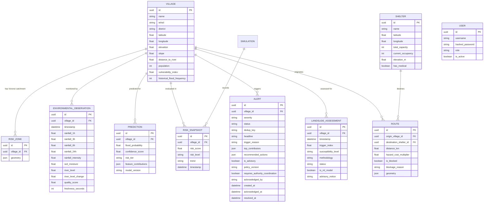

# Flowshield — Database & Spatial Storage Architecture

---

## 1. Dual-Engine Storage Architecture

Flowshield employs a **Dual-Engine Pattern** to achieve both enterprise-grade spatial scalability and frictionless local evaluation:

1. **Production Engine: PostgreSQL 16 + PostGIS 3.4**
   - Configured in `docker-compose.yml`.
   - Utilizes native PostGIS geometry columns (`Geometry(POINT, 4326)`, `Geometry(POLYGON, 4326)`, `Geometry(LINESTRING, 4326)`).
   - High-performance spatial indexing with R-Tree GiST indexes (`CREATE INDEX ... USING GIST(geom)`).
   - True ellipsoidal distance calculations via `ST_Distance(geography, geography)`.

2. **Developer & Demo Fallback Engine: SQLite 3**
   - Active database file: `flowshield.db` (root directory).
   - Connect argument: `{"check_same_thread": False}` for multi-threaded FastAPI access.
   - Geometries stored as serialized GeoJSON `JSON` columns.
   - Spatial proximity computed via native Python `haversine_distance_km(lat1, lon1, lat2, lon2)`.

---

## 2. Entity Relational Models & Schemas

---

## 3. Detailed Model Catalog

### 3.1 `Village` (`villages`)
Represents a monitored human settlement.
- `id`: UUID primary key.
- `name`, `tehsil`, `district`, `state`: Geographic location identifiers.
- `population`: Census estimate for at-risk exposure calculation.
- `elevation`: Altitude in meters (affects mountain rainfall and runoff speed).
- `slope`: Terrain incline in degrees (governs velocity and debris flow risk).
- `distance_to_river`: Euclidean distance in meters to nearest river reach.
- `vulnerability_index`: Normal factor $\in [0, 1]$ based on masonry type, elderly population, and access infrastructure.
- `historical_flood_frequency`: Number of recorded inundation events in past 10 years.

### 3.2 `RiskZone` (`risk_zones`)
Precomputed Voronoi catchment polygon around each settlement.
- `id`: UUID primary key.
- `village_id`: Foreign key to `villages.id`.
- `geometry`: GeoJSON Polygon coordinates defining the spatial boundary of influence.

### 3.3 `EnvironmentalObservation` (`environmental_observations`)
Point-in-time sensor readings for a village catchment.
- `rainfall_1h`, `rainfall_3h`, `rainfall_6h`, `rainfall_24h`: Cumulative precipitation in mm.
- `rainfall_intensity`: Instantaneous rate in mm/h.
- `soil_moisture`: Volumetric water content / saturation percentage ($0 - 100\%$).
- `river_level`, `river_level_change`: Monitored reach water height and surge derivative.
- `quality_score`: Data validation indicator.
- `freshness_seconds`: Sensor latency tracking.

- `river_level`: Current stage height in meters.
- `river_level_change`: 1-hour rise/fall rate in m/h.
- `quality_score`: Confidence score $\in [0, 1]$ reflecting sensor health.
- `freshness_seconds`: Elapsed time since hardware packet reception.

### 3.4 `Prediction` (`predictions`)
Machine learning inference record.
- `flood_probability`: Raw XGBoost sigmoid output ($P \in [0, 1]$).
- `feature_contributions`: Serialized JSON array of SHAP attributions:
  `[{"feature": "rainfall_3h", "shap_value": 0.32, "display_name": "Rainfall (3h Accumulation)"}, ...]`
- `model_version`: Tagged model identifier (e.g., `xgb-v1.0.0-20260910-082823`).

### 3.5 `Alert` (`alerts`)
Emergency dispatches triggered by operational risk thresholds.
- `dedup_key`: Unique string token (`village_id:severity:simulation_substep`) preventing alert spam.
- `severity`: Alert tier (`WATCH`, `ADVISORY`, `WARNING`, `CRITICAL`).
- `status`: Lifecycle state (`ACTIVE`, `ACKNOWLEDGED`, `RESOLVED`).
- `is_advisory`: Boolean flag denoting statutory decision support status.
- `policy_version`: Policy engine release tag (`2.4.0`).
- `requires_authority_coordination`: Boolean flag for multi-agency dispatch.
- `recommended_actions`: Pre-computed NDMA Standard Operating Procedures.
- **Unique Constraint**: `CREATE UNIQUE INDEX uq_alerts_village_dedup_status ON alerts(village_id, dedup_key, status)`.

### 3.6 `LandslideAssessment` (`landslide_assessments`)
Multi-hazard empirical slope instability records.
- `id`: UUID primary key.
- `village_id`: Foreign key to `villages.id`.
- `timestamp`: Evaluation time.
- `trigger_index`: Computed empirical hazard metric $\in [0, 100]$.
- `susceptibility_level`: Risk tier (`LOW`, `MODERATE`, `HIGH`, `CRITICAL`).
- `methodology`: Empirical formula citation (`Empirical Rainfall-Slope Threshold (GSI / Caine 1980)`).
- `status`: Statutory status tag (`PROTOTYPE_EMPIRICAL_THRESHOLD`).
- `is_ml_model`: Integer/Boolean flag (0 / `False`) explicitly preventing misrepresentation.
- `advisory_notice`: Standardized scientific disclaimer text.

### 3.7 `Route` (`routes`)
Evacuation corridors linking settlements to designated safe shelters.
- `origin_village_id`: Source settlement ID.
- `destination_shelter_id`: Safe destination shelter ID.
- `distance_km`: Base path distance.
- `hazard_cost_multiplier`: Dynamic cost factor based on active flood and landslide exposure ($1.0 \times \text{penalty}$).
- `is_blocked`, `blockage_reason`: Real-time passability flag.
- `geometry`: GeoJSON LineString coordinates.

### 3.8 `User` (`users`)
Authority and responder credentials.
- `username`: Unique username (e.g., `demo`, `admin`, `responder1`).
- `hashed_password`: Salted Bcrypt hash.
- `role`: RBAC permissions (`ADMIN`, `OPERATOR`, `FIRST_RESPONDER`, `CITIZEN`).
- `is_active`: Account status flag.

---

## 4. Seeding & Database Migrations

- **Alembic Migration**: `alembic/versions/7b1c2b825c38_initial_schema.py` and `alembic/versions/c2d4_v2_4_schema_expansion.py`.
- **v2.4 Migration Scripts**:
  - `scripts/migrate_v2_4_landslide.py`: Creates `landslide_assessments` table and indexes.
  - `scripts/migrate_v2_4_phase5.py`: Adds `is_advisory`, `policy_version`, `requires_authority_coordination` to `alerts`, `hazard_cost_multiplier` to `routes`, and creates `uq_alerts_village_dedup_status` unique index.
- **Seeding Script**: `scripts/seed_db.py` populates:
  - 20 settlements from `data/seed/villages.geojson`.
  - Computes Voronoi catchment polygons using `scipy.spatial.Voronoi` bounded within Mandi district coordinates.
  - 8 safe shelters from `data/seed/shelters.geojson`.
  - 3 river reaches from `data/seed/rivers.geojson`.
  - 5 evacuation corridors from `data/seed/routes.geojson`.
  - Baseline hydro-meteorological observations from `data/seed/initial_observations.json`.
  - Seed users (`demo` / `flowshield2026`, `admin` / `password123`, `responder` / `responder2026`).

---

## 5. Real Public Datasets & Data Provisioning

### 5.1 Public Datasets Ingested (`data/real/`)
- `data/real/mandi_era5_hourly_raw.csv`: 15,624 continuous hourly observations from ECMWF Copernicus ERA5-Land covering Mandi District monitoring nodes (July-Aug 2023 catastrophe and July 2022 baseline).
- `data/real/mandi_real_hydrology_features.csv`: 15,624 records with 30 engineered physical hydrological features including rolling accumulations ($1\text{h}, 3\text{h}, 6\text{h}, 24\text{h}, 72\text{h}$), upper and deep soil moisture saturation %, temperature, pressure, humidity, and verified disaster occurrence flags.
- `data/real/beas_basin_historical_floods.csv`: Historical cloudburst and flood disaster catalog for Beas Basin / Mandi (1995–2023) compiled from HiFlo-DAT, HPSDMA, and CWC bulletins.
- `data/real/indofloods/`: Peer-reviewed national flood archive (Zenodo DOI: `10.5281/zenodo.14584654`) with 4,548 observational flood events and 108 catchment attributes.

### 5.2 User Telemetry Provisioning Contract (`data/user_provided/`)
- Specification document: [`data/DATA_SPECIFICATION_USER_INPUT.md`](file:///c:/Users/Pranav/Desktop/Flowshield/data/DATA_SPECIFICATION_USER_INPUT.md)
- Ingestion and sanity validation script: `scripts/ingest_user_data.py`
- Targeted field data:
  1. CWC River Stage Gauge Telemetry (15-min stage height $m$ and discharge $m^3/s$).
  2. IMD Automatic Weather Station (AWS) 15-min rainfall sensor logs.
  3. Dam Operations Logs for Pandoh & Larji dams (hourly inflow/outflow cumecs).
  4. In-situ hillslope soil moisture & piezometer telemetry.

Cross-references:
- Architecture: [`architecture.md`](./architecture.md)
- Domain Rules & Bounds: [`business-rules.md`](./business-rules.md)
- Local Setup & Seeding: [`how-to-run.md`](./how-to-run.md)
- Dataset Provenance: [`data/real/DATASET_PROVENANCE.md`](file:///c:/Users/Pranav/Desktop/Flowshield/data/real/DATASET_PROVENANCE.md)
