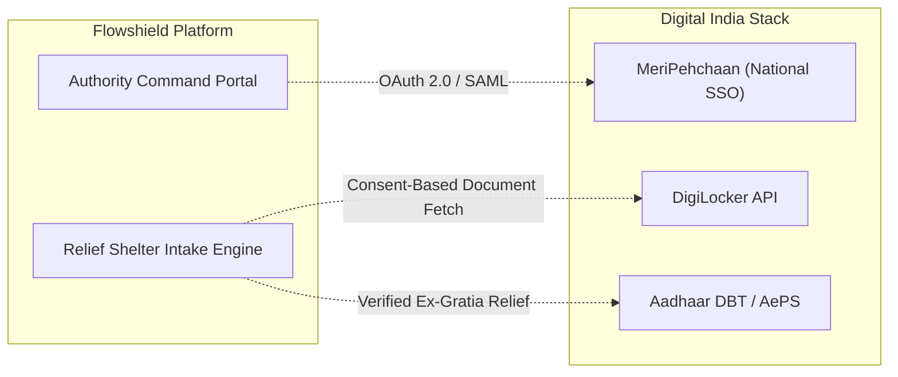

# Flowshield — Government IDs, Identity & Authority Architecture

---

## 1. Overview & Purpose

In disaster management operations, identity verification operates on two critical fronts:
1. **Authority Authentication & Accountability**: Ensuring only verified incident commanders and disaster response officers (DDMA, SDRF, NDRF) can authorize sirens, trigger mass evacuation alerts, or acknowledge emergency dispatches.
2. **Citizen Identity Safeguarding & Relief Camp Intake**: Protecting displaced citizens' legal identities during flash flood evacuations and laying the groundwork for digital relief camp enrollment and direct compensation disbursements.

---

## 2. Authority Identity & Role-Based Access Control (RBAC)

Authority identities are modeled in `app/models/user.py` and validated via cryptographic JSON Web Tokens (JWT):

### 2.1 Role Hierarchy & Permissions

| Role | Target Persona | Permissions |
|---|---|---|
| **`ADMIN`** | System Administrator / State IT Cell | Full system configuration, user provisioning, seed resets, model version promotion. |
| **`OFFICER`** | DDMA Incident Commander / SDRF Officer | Acknowledge emergency alerts, trigger village-level SOP actions, advance simulation steps, override route blockage flags. |
| **`VIEWER`** | Inter-Agency Observer / Meteorological Analyst | Read-only access to GIS maps, telemetry streams, and SHAP explainability drawers. |

### 2.2 Token Claims Structure
Tokens emitted by `/api/v1/auth/login` encode:
```json
{
  "sub": "demo",
  "role": "OFFICER",
  "id": "ad0a106d-7f54-4eae-9aec-6dd0e8962023",
  "exp": 1789117534
}
```
Endpoints modifying disaster state verify the Bearer token and check `role in ['OFFICER', 'ADMIN']`.

---

## 3. Citizen Identity Safeguarding in Emergencies

During catastrophic flash flood events in mountain valleys, lost physical identity documents (Aadhaar cards, voter IDs, ration cards, land ownership papers) severely delay subsequent relief compensation and rehabilitation efforts.

### 3.1 Citizen Mode Offline Guidance
Flowshield's mobile interface ([`CitizenWarning.tsx`](file:///c:/Users/Pranav/Desktop/Flowshield/apps/web/src/components/citizen/CitizenWarning.tsx#L205)) embeds prominent preparedness guidance:
> **Checklist Item #2**: *"Keep original IDs (Aadhaar, ration card, voter ID) in a sealed waterproof plastic pouch inside your evacuation go-bag."*

### 3.2 Zero-Auth Citizen Protection
To prevent delays during sudden river surges, **Citizen Emergency View requires zero authentication or identity entry**. Citizens can view alerts and safe shelter routes immediately without being blocked by Aadhaar OTP or mobile verification screens.

---

## 4. Government Technology Stack Integration Roadmap

Flowshield's architecture is prepared for direct integration with India's digital public infrastructure (India Stack):



### 4.1 MeriPehchaan (National Single Sign-On / Jan Parichay)
- **Use Case**: Enables officers from Himachal Pradesh State Disaster Management Authority (HPSDMA), NDMA, and local district administrations to log into Flowshield using their official government credentials without managing separate passwords.

### 4.2 DigiLocker Disaster Relief Intake
- **Use Case**: At relief camp intake, displaced citizens whose physical documents were lost can grant one-time consent to fetch verified digital copies of their Aadhaar, ration card, and Jan Dhan bank details directly from DigiLocker into the shelter intake database.

### 4.3 Direct Benefit Transfer (DBT) Ex-Gratia Linkage
- **Use Case**: Integration with state disaster relief compensation funds (SDRF / NDRF) using Aadhaar-linked bank accounts to automate emergency monetary relief distribution to verified evacuees.

Cross-references:
- API Auth Specifications: [`api.md`](./api.md)
- Database User Model: [`database.md`](./database.md)
- Citizen Mode Interface: [`project-overview.md`](./project-overview.md)
